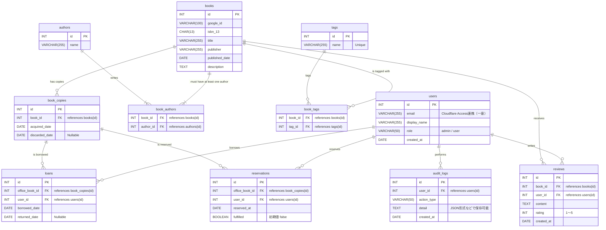

# 蔵書管理アプリ DB定義書（Cloudflare Access + Remix構成）

## 設計方針

- 認証情報は Cloudflare Access によるJWT（cf-access-jwt-assertion）から `email` を取得し、`users.email` で一意管理
- ロール管理で `admin / user` を切り分け。画面側で分岐。
- `audit_logs` により操作ログを記録（貸出、返却、削除など）
- `reviews`, `reservations` は必須要件に基づき実装
- 蔵書（book_copies）は論理削除（`discarded_date`）により管理
- D1（SQLite）は `DATE` 型をサポートせず、Drizzle ORM では日付カラムを `TEXT` として定義（ISO 8601 形式の文字列）する必要がある。
- 本ドキュメント上の `DATE` 記載は便宜上の表現であり、実装上は `TEXT` 型として扱う。

## カラム制約方針

- 原則として全カラムは `NOT NULL` を基本とする。
- ただし、以下のカラムは明示的に `NULL` を許容する：
  - `book_copies.discarded_date`：論理削除用のフィールドであり、廃棄されていない蔵書については NULL のままとする必要があるため。
  - `loans.returned_date`：貸出中の本については返却日時が未定であり、返却完了時にのみ値が入るため NULL を許容する必要がある。
