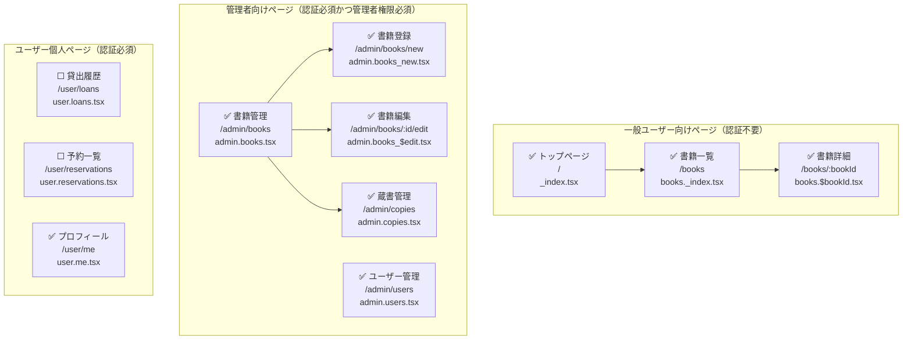

# 蔵書管理アプリ 画面構成

## 認証区分と画面一覧

| 画面名       | URLパス例                   | ファイル名                 | 用途・概要                                                                           | 認証     | 進捗       |
| ------------ | --------------------------- | -------------------------- | ------------------------------------------------------------------------------------ | -------- | ---------- |
| トップページ | `/`                         | `_index.tsx`               | アプリの紹介、ログインリンク、簡単な使い方表示など                                   | 不要     | ✅ 実装済み |
| 書籍一覧     | `/books`                    | `books._index.tsx`         | 貸出可能な書籍一覧。蔵書ありの本のみ表. タイトル・著者・タグ・出版社で検索／一覧表示 | 不要     | ✅ 実装済み |
| 書籍詳細     | `/books/:bookId`            | `books.$bookId.tsx`        | 書籍の詳細、レビュー表示など                                                         | 不要     | ✅ 実装済み |
| プロフィール | `/user/me`                  | `user.me.tsx`              | 表示名の変更など                                                                     | ユーザー | ✅ 実装済み |
| ユーザー管理 | `/admin/users`              | `admin.users.tsx`          | 管理者によるユーザーの管理                                                           | 管理者   | ✅ 実装済み |
| 書籍管理     | `/admin/books`              | `admin.books._index.tsx`   | 管理者による書籍情報の管理。蔵書ゼロの本も含む                                       | 管理者   | ✅ 実装済み |
| 書籍登録     | `/admin/books/new`          | `admin.books.new.tsx`      | 管理者による新規登録（Google Books API使用）                                         | 管理者   | ✅ 実装済み |
| 書籍編集     | `/admin/books/:bookId/edit` | `admin.books.$edit.tsx`    | 管理者による書籍情報の編集                                                           | 管理者   | ✅ 実装済み |
| 蔵書管理     | `/admin/copies/:bookId`     | `admin.copies.$bookId.tsx` | 管理者による蔵書の管理                                                               | 管理者   | ✅ 実装済み |
| 貸出履歴     | `/user/loans`               | `user.loans.tsx`           | 自分の貸出履歴を確認                                                                 | ユーザー | ⬜ 未着手   |
| 予約一覧     | `/user/reservations`        | `user.reservations.tsx`    | 自分が予約中の書籍一覧                                                               | ユーザー | ⬜ 未着手   |

## 構成方針
- 認証不要ページ：トップ、書籍一覧、書籍詳細
- Cloudflare Accessでログイン済みユーザーを特定し、roleによって管理者画面を制御
- Remixでは **flat構造を基本** とし、各ページを機能単位で完結させる
- 管理者向け画面はすべて `/admin/*`に、ユーザー向け画面はすべて `/user/*`に統一し、アクセス制御を集約
- ファイル構造を浅く保つことで、画面数が多くなっても見通しを良くする
- 画面のタイトル名は `<page_name> | BookVault` とする

## 備考
- `books/:bookId/edit` のようなルートも flat に展開する場合、ファイル名工夫（例: `books_$edit.tsx`）が必要
- 必要に応じて `handle.meta`, `handle.breadcrumb`, `handle.requireAuth` などを活用しルートに情報を持たせる
- 複雑な UI 状態（モーダルなど）は `useFetcher`, `useNavigation` を併用
